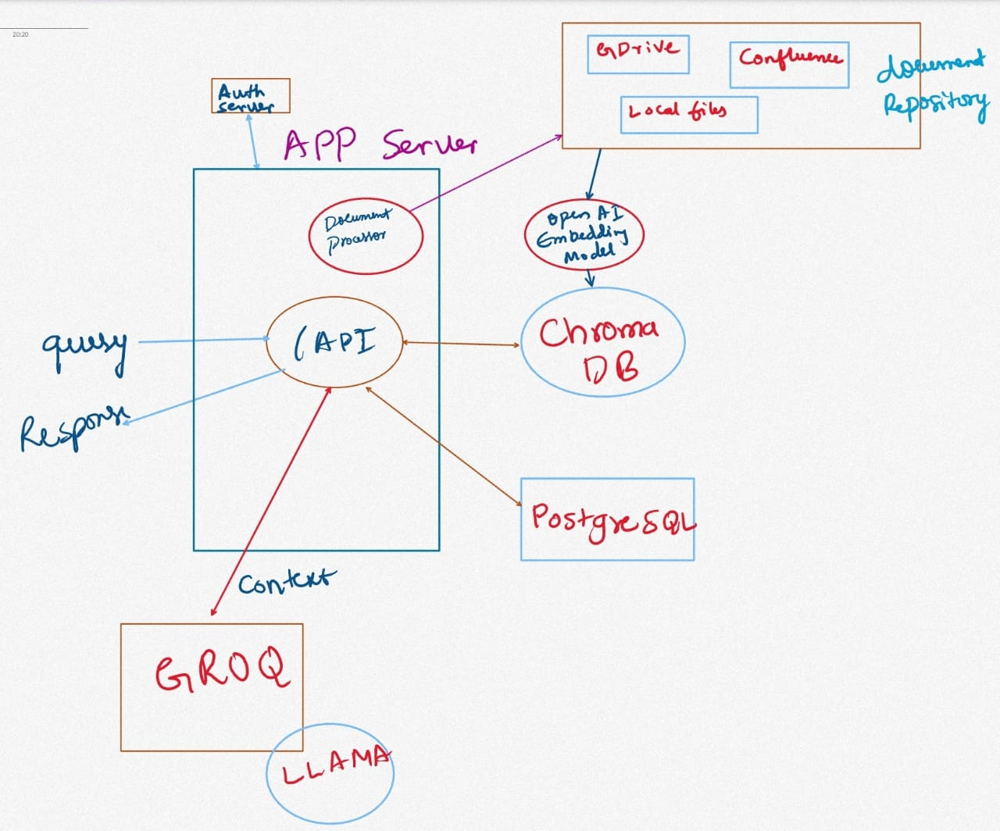

# RAG (Retrieval-Augmented Generation) Application

This is a Flask-based RAG application that utilizes Chroma DB for vector storage and Groq for language model processing, designed to efficiently manage and query document embeddings from various sources.

## Overview

The RAG application not only processes local files but also integrates with cloud-based document repositories such as **Google Drive** and **Confluence**. This allows users to seamlessly read files and create indexes for them, enhancing the application's versatility and usability.

## Architecture
 

## Features

- **Document Processing**: Supports indexing of PDF, DOCX, and TXT files from local storage.
- **Cloud Integration**: 
  - **Google Drive**: Authenticate using a JSON credentials file to access documents stored in Google Drive, enabling users to index and query their cloud-based files.
  - **Confluence**: Connect to Confluence to read and index documentation, making it easy to retrieve information from collaborative platforms.
- **OpenAI Embeddings**: Utilizes OpenAI embeddings for effective document vectorization.
- **RAG Pipeline**: Implements a Retrieval-Augmented Generation pipeline for answering questions based on indexed documents.
- **API Endpoint**: Provides a simple API endpoint for querying the system.
- **Chat History Tracking**: Tracks chat histories and metadata in a PostgreSQL database, allowing for efficient retrieval and analysis of past interactions.
- **Authorization**: Implements a scalable authorization mechanism that validates tokens and retrieves user profiles from an authentication server, ensuring secure access to the application.
- **Contextual Responses**: Incorporates existing chat history into the LLM's context to generate more relevant and coherent responses.

## Efficient Use of Chroma DB

Our application leverages Chroma DB as a vector store for efficient management and querying of document embeddings. Key optimizations include:

1. **Smart Initialization**: Checks for an existing vector store to avoid unnecessary reprocessing of documents.
2. **Persistence**: Stores the vector database in a dedicated directory, maintaining the knowledge base across multiple application runs.
3. **Load or Create**: Attempts to load an existing vector store on startup; creates a new one only if none exists.
4. **Efficient Document Processing**: Processes documents once, splits them into chunks, and embeds them for precise similarity searches.
5. **One-Time Embedding Creation**: Creates document embeddings only once, significantly reducing startup time for subsequent runs.
6. **Optimized Similarity Search**: Utilizes Chroma DB's built-in similarity search functionality for efficient querying.
7. **Scalability**: Scales well with increasing document numbers, allowing new documents to be added without reprocessing existing ones.
8. **Memory Efficiency**: Handles larger document collections than what might fit in memory through persistent storage.
9. **Consistency**: Ensures consistent search results across application restarts due to vector store persistence.
10. **Flexibility for Updates**: The structure allows for future enhancements, such as incremental updates to the vector store.

## Authorization Mechanism

The application includes a robust authorization mechanism that validates user tokens and retrieves user profiles from an authentication server. This mechanism is designed to be scalable and reusable across different API endpoints. 

### Key Features of the Authorization System:
- **Token Validation**: Automatically checks for the presence of an authorization token in the request headers.
- **Profile Retrieval**: Fetches user profile information from the authentication server, allowing for personalized interactions.
- **Scalability**: The authorization decorator can be easily applied to any API endpoint, ensuring secure access throughout the application.

### Usage in Other APIs
To use the authorization mechanism in other API endpoints, simply decorate your route functions with the `@authorize_request` decorator. This will ensure that the token is validated and the user profile is available in the request context.

### Example:
```
from src.services.auth_service import authorize_request

@query_bp.route('/another_endpoint', methods=['GET'])
@authorize_request
def another_endpoint():
    # Your endpoint logic here
    
```
### curl
```
curl -X POST http://localhost:5000/query \
-H "Authorization: Bearer your_access_token" \
-H "Content-Type: application/json" \
-d '{"query": "Your question here"}'
```

## Contextual Responses with Chat History

The application supports incorporating existing chat history into the context for generating responses. This feature enhances the LLM's ability to provide relevant and coherent answers based on previous interactions.

### How It Works:
- When a user queries the system with an existing `chat_id`, the application retrieves the associated chat history.
- The chat history is formatted and included in the prompt sent to the LLM, allowing it to generate responses that consider the context of the conversation.

### Example of Chat History Formatting:
The chat history is formatted as follows:
```
User: [User's previous input]
AI: [AI's previous response]
```

This context is combined with the current user query to create a comprehensive prompt for the LLM.

## Installation

1. **Clone the repository**:
   ```bash
   git clone https://github.com/prathik-anand/RAG
   cd RAG
   ```

2. **Create and activate a virtual environment**:

   **Windows**:
   ```bash
   python -m venv .venv
   .venv\Scripts\activate
   ```

   **Linux or MacOS**:
   ```bash
   python3 -m venv .venv
   source .venv/bin/activate
   ```

3. **Install the required packages**:
   ```bash
   pip install -r requirements.txt
   ```

4. **Set up your environment variables** by creating a `.env` file in the root directory with the following content:
   ```plaintext
   GROQ_API_KEY=your_groq_api_key
   OPENAI_API_KEY=your_openai_api_key
   GOOGLE_DRIVE_CREDENTIALS=path/to/your/credentials.json  # Path to your Google Drive JSON credentials file
   CONFLUENCE_API_KEY=your_confluence_api_key
   DOCUMENTS_DIRECTORY=data
   VECTOR_STORE_PATH=vector_store
   DB_HOST=yourhost # e.g. localhost
   DB_PORT=your_postgres_port # e.g. 5432
   DB_NAME=dbname # e.g. RAG_CHAT
   DB_USER=dbusername # e.g. postgres
   DB_PASSWORD=dbpassword # e.g. xyzabc
   AUTH_SERVER_URL=http://localhost:5010  # URL for the auth server
   ```

## Usage

1. **Place your documents** (PDF, DOCX, TXT) in the `data` directory or connect to your Google Drive and Confluence accounts.

2. **Run the application**:
   ```bash
   python main.py
   ```

3. The application will start and create/load the vector store as necessary.

4. **To query the system**, send a POST request to `http://localhost:5000/api/query` with a JSON body:
   ```json
   {
     "question": "Your question here"
   }
   ```

## Project Structure

- `main.py`: Entry point of the application.
- `src/`: Contains the main application code.
  - `app.py`: Flask application setup.
  - `api/`: API endpoints.
  - `services/`: Business logic.
  - `repositories/`: Data access layer.
  - `utils/`: Utility functions.
  - `config.py`: Configuration management.
  - `constants.py`: Constant values used across the application.
- `data/`: Directory for storing documents to be processed.
- `vector_store/`: Directory where the Chroma vector store is persisted.

## Authorization Repository (Required for the application to work)

For a more comprehensive authorization solution, consider using the following repository:
```bash
git clone https://github.com/prathik-anand/Auth-Flask
```

## Conclusion

This RAG application provides a powerful framework for efficiently managing and querying document embeddings from both local and cloud-based sources, enhancing the user experience through fast and accurate information retrieval. Additionally, it tracks chat histories and metadata in a PostgreSQL database, allowing for comprehensive analysis of user interactions. The scalable authorization mechanism ensures secure access to the application, making it suitable for various use cases. The incorporation of chat history into the LLM's context further improves the relevance and coherence of responses, enhancing the overall conversational experience.
